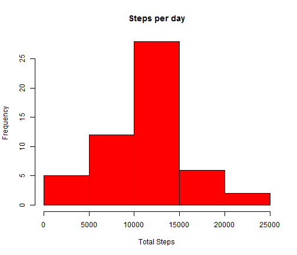
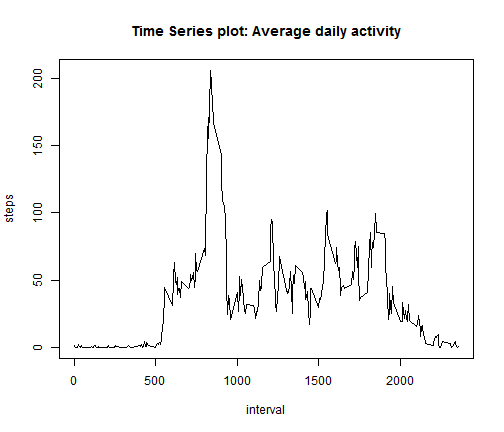
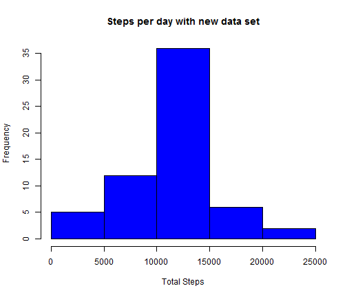
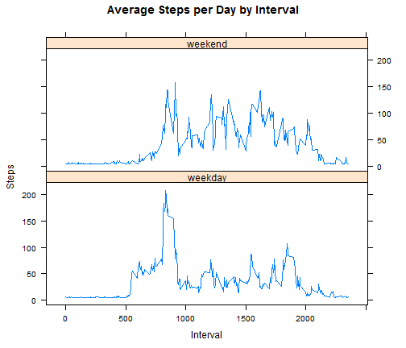

## Loading and preprocessing the data

```r
library(lattice)
unzip("activity.zip", exdir="data")
activity<- read.table("data/activity.csv", sep=",", header=TRUE, na.strings="NA")
activity_rm_na<-activity[!is.na(activity),]
```

## What is mean total number of steps taken per day?

```r
data1 <- aggregate(steps ~ date, data = activity_rm_na, FUN=sum)
data1$date <- as.Date(data1$date, "%Y-%m-%d")
```
Histogram of the total number of steps taken each day

```r
hist(data1$steps,col = "red", 
     main = "Steps per day", xlab = "Total Steps", ylab = "Frequency")
```

 

Calculate and report the mean and median total number of steps taken per day

```r
rmean<-format(mean(data1$steps))
rmedian<-format(median(data1$steps))
```
**The mean total number of steps taken are 10766.19**  
**The median total number of steps taken are 10765**

## What is the average daily activity pattern?
Time series plot (i.e. type = "l") of the 5-minute interval (x-axis) 
and the average number of steps taken, averaged across all days (y-axis)

```r
int <- aggregate(steps ~ interval, data = activity_rm_na, mean)
plot(steps ~ interval, data = int, type = "l",
     main="Time Series plot: Average daily activity")
```

 

Which 5-minute interval, on average across all the days in the dataset, contains the maximum number of steps?

```r
rint<- int$interval[which.max(int$steps)]
```
**Maximum number of steps are during a 5-minute interval is 835**

## Imputing missing values
Calculate and report the total number of missing values in the dataset 

```r
val<-sum(is.na(activity$steps))
```
**Total number of missing values in the dataset is 2304**


Devise a strategy for filling in all of the missing values in the dataset.  
**Strategy used is to use the mean of the dataset instead of NA**


Create a new dataset that is equal to the original dataset but with the missing data filled in.

```r
data2<- activity
data2[is.na(data2$steps),]$steps <- mean(activity$steps, na.rm=TRUE)
data2$date <- as.Date(data2$date, "%Y-%m-%d")
```

Make a histogram of the total number of steps taken each day and Calculate and report the mean and median total number of steps taken per day. 

```r
data2_agg <- aggregate(steps ~ date, data = data2, FUN=sum)
hist(data2_agg$steps,col = "blue", 
     main = "Steps per day with new data set", xlab = "Total Steps", 
     ylab = "Frequency")
```

 

Calculate and report the mean and median total number of steps taken per day

```r
rmean2<-format(mean(data2_agg$steps))
rmedian2<-format(median(data2_agg$steps))
```
**The mean total number of steps taken are 10766.19**  
**The median total number of steps taken are 10766.19**

Do these values differ from the estimates from the first part of the assignment? What is the impact of imputing missing data on the estimates of the total daily number of steps?

```r
difmean<- format(abs(mean(data1$steps)-mean(data2_agg$steps)))
difmedian<- format(abs(median(data1$steps)-median(data2_agg$steps)))
```
**The difference in mean total number of steps taken is 0**  
**The difference in median total number of steps taken are 1.188679**  
**Imputing missing data changes the estimates. the histograms for second set has higher frequency**

## Are there differences in activity patterns between weekdays and weekends?
Create a new factor variable in the dataset with two levels -- "weekday" and "weekend" indicating whether a given date is a weekday or weekend day.

```r
data2$day<- as.factor(ifelse(weekdays(data2$date) %in% c('Saturday', 'Sunday'),"weekend","weekday"))
```

Make a panel plot containing a time series plot (i.e.  type = "l" ) of the 5-minute interval (x-axis) and the average number of steps taken, averaged across all weekday days or weekend days (y-axis).

```r
data3 <- aggregate(data2$steps, by=list(data2$interval, data2$day), mean)
colnames(data3)<-c("interval", "day", "steps")
xyplot(steps ~ interval|day, data=data3, 
       main="Average Steps per Day by Interval",xlab="Interval", 
       ylab="Steps",layout=c(1,2), type="l")
```

 
